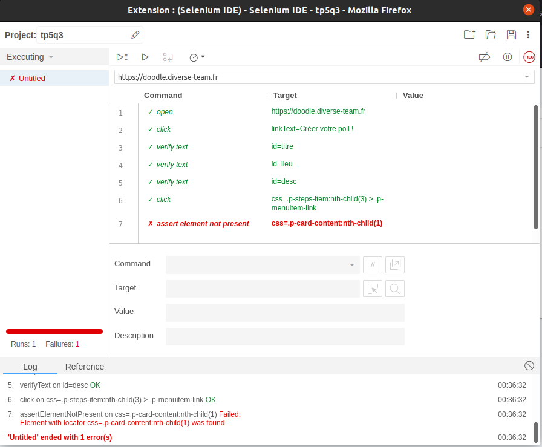

## Find a bug

Clone the [Simba Organizer repository](https://github.com/barais/doodlestudent/) and follow the instructions to run the
application on your machine.

Find a bug in the application.

With the help of Selenium and the Page Object Model desing pattern write a simple test that fails for this bug.

Optionally make a pull request to the project.

Include in this document the code of the test and, if you did it, the link to the pull request.

## Answer

Nous avons trouvé un bug permettant, a la création d'un poll de passer directement a l'étape 2 ou 3 sans même avoir
rempli les champs pourtant obligatoires. Pour cela il suffit de ne pas utiliser le bouton next mais de clicker
directement sur les nombres en haut. Pour détecter ce bug nous avons choisis d'utiliser Selenium IDE :



Le procédé est simple nous allons sur la page et vérifions que les champs sont vides. Nous cliquons sur les chiffres en
haut et vérifions si le text récapitulatif est présent. Sans le bug, il devrait être absent car le click n'aura eu aucun
effet. Le test ne passe pas, révélant le bug au grand jour.

Pour reproduire notre travail voici le code selenium IDE :

```json
{
  "id": "fefc2e33-8b67-42db-85e2-d3ceae5abf78",
  "version": "2.0",
  "name": "tp5q3",
  "url": "https://doodle.diverse-team.fr",
  "tests": [
    {
      "id": "9299aa1b-ff7c-4e40-b889-3a60224e5b95",
      "name": "Untitled",
      "commands": [
        {
          "id": "3747a0bd-8240-4c53-9d89-b55555280783",
          "comment": "",
          "command": "open",
          "target": "https://doodle.diverse-team.fr",
          "targets": [],
          "value": ""
        },
        {
          "id": "267e4006-7e8a-4538-a5c5-284b00cbee81",
          "comment": "",
          "command": "click",
          "target": "linkText=Créer votre poll !",
          "targets": [
            [
              "linkText=Créer votre poll !",
              "linkText"
            ],
            [
              "css=.Home_CreateLink",
              "css:finder"
            ],
            [
              "xpath=//a[contains(text(),'Créer votre poll !')]",
              "xpath:link"
            ],
            [
              "xpath=//a[contains(@href, '/create')]",
              "xpath:href"
            ],
            [
              "xpath=//a",
              "xpath:position"
            ],
            [
              "xpath=//a[contains(.,'Créer votre poll !')]",
              "xpath:innerText"
            ]
          ],
          "value": ""
        },
        {
          "id": "2352635f-a91c-4680-98e1-160974d8e020",
          "comment": "",
          "command": "verifyText",
          "target": "id=titre",
          "targets": [],
          "value": ""
        },
        {
          "id": "81bfaf05-e841-40c7-a369-9d073b6118de",
          "comment": "",
          "command": "verifyText",
          "target": "id=lieu",
          "targets": [
            [
              "id=lieu",
              "id"
            ],
            [
              "css=#lieu",
              "css:finder"
            ],
            [
              "xpath=//input[@id='lieu']",
              "xpath:attributes"
            ],
            [
              "xpath=//div[2]/input",
              "xpath:position"
            ]
          ],
          "value": ""
        },
        {
          "id": "856ef7d2-7594-43ad-a546-90e6cef4e359",
          "comment": "",
          "command": "verifyText",
          "target": "id=desc",
          "targets": [
            [
              "id=desc",
              "id"
            ],
            [
              "css=#desc",
              "css:finder"
            ],
            [
              "xpath=//textarea[@id='desc']",
              "xpath:attributes"
            ],
            [
              "xpath=//textarea",
              "xpath:position"
            ]
          ],
          "value": ""
        },
        {
          "id": "a14439f0-b67e-4ee6-a6e6-79608c17aa87",
          "comment": "",
          "command": "click",
          "target": "css=.p-steps-item:nth-child(3) > .p-menuitem-link",
          "targets": [
            [
              "css=.p-steps-item:nth-child(3) > .p-menuitem-link",
              "css:finder"
            ],
            [
              "xpath=//li[3]/a",
              "xpath:position"
            ]
          ],
          "value": ""
        },
        {
          "id": "9af589a3-21d3-4094-8b7e-b8ddf55df622",
          "comment": "",
          "command": "assertElementNotPresent",
          "target": "css=.p-card-content:nth-child(1)",
          "targets": [
            [
              "css=.p-card-content:nth-child(1)",
              "css:finder"
            ],
            [
              "xpath=//div[3]/p-card/div/div/div",
              "xpath:position"
            ]
          ],
          "value": ""
        }
      ]
    }
  ],
  "suites": [
    {
      "id": "0853b9b8-51ab-4567-bd99-37f65858bfce",
      "name": "Default Suite",
      "persistSession": false,
      "parallel": false,
      "timeout": 300,
      "tests": [
        "9299aa1b-ff7c-4e40-b889-3a60224e5b95"
      ]
    }
  ],
  "urls": [
    "https://doodle.diverse-team.fr/"
  ],
  "plugins": []
}
```